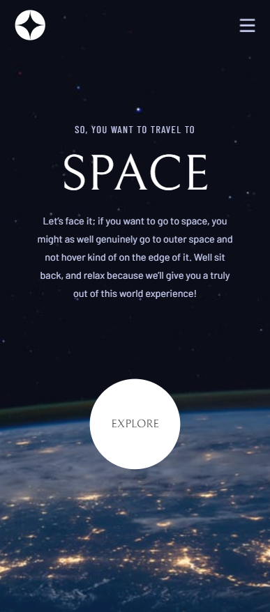

# Frontend Mentor - Space tourism website solution

This is a solution to the [Space tourism website challenge on Frontend Mentor](https://www.frontendmentor.io/challenges/space-tourism-multipage-website-gRWj1URZ3). Frontend Mentor challenges help you improve your coding skills by building realistic projects.

## Table of contents

- [Overview](#overview)
  - [The challenge](#the-challenge)
  - [Screenshot](#screenshot)
  - [Links](#links)
- [My process](#my-process)
  - [Built with](#built-with)
  - [What I learned](#what-i-learned)
  - [Continued development](#continued-development)
  - [Useful resources](#useful-resources)
- [Author](#author)
- [Acknowledgments](#acknowledgments)

## Overview

This is my first intermediate frontend mentor challenge using Next.js.

### The challenge

Users should be able to:

- View the optimal layout for each of the website's pages depending on their device's screen size
- See hover states for all interactive elements on the page
- View each page and be able to toggle between the tabs to see new information

### Screenshot

Desktop

Tablet

Mobile

### Links

- Solution URL: [Add solution URL here](https://your-solution-url.com)
- Live Site URL: [Add live site URL here](https://your-live-site-url.com)

## My process

In this section, I'll go over my thought process, the challenges I faced, and the solutions I implemented while building this project.

### Built with

- Semantic HTML5 markup
- CSS custom properties
- TypeScript
- Flexbox
- CSS Grid
- Mobile-first workflow
- [React](https://reactjs.org/) - JS library
- [Next.js](https://nextjs.org/) - React framework
- [Tailwind CSS](https://tailwindcss.com) - CSS Library

### What I learned

While working on this project, I learned how to effectively use Next.js to create a multi-page website. I also gained experience with Tailwind CSS, which greatly simplified my CSS workflow. Additionally, I improved my skills in creating responsive designs using Flexbox and CSS Grid.

This is how i got data and used signals to dynamically render data:

### Continued development

In the future, I plan to continue challenging myself with more complex frontend projects.

### Useful resources

- [Next.js Documentation](https://tailwindcss.com/docs/installation) - This was my go-to resource for learning Next.js.
- [Tailwind CSS Documentation](https://tailwindcss.com/docs/installation) - The official documentation for Tailwind CSS was very helpful in understanding how to use the library effectively.

## Author

- Frontend Mentor - [@Dmino228](https://www.frontendmentor.io/profile/Dmino228)
- Twitter - [@Dmino228](https://x.com/Dmino228)
- Discord - [@Dmino](https://discord.com/users/450691197522935818)

## Acknowledgments
